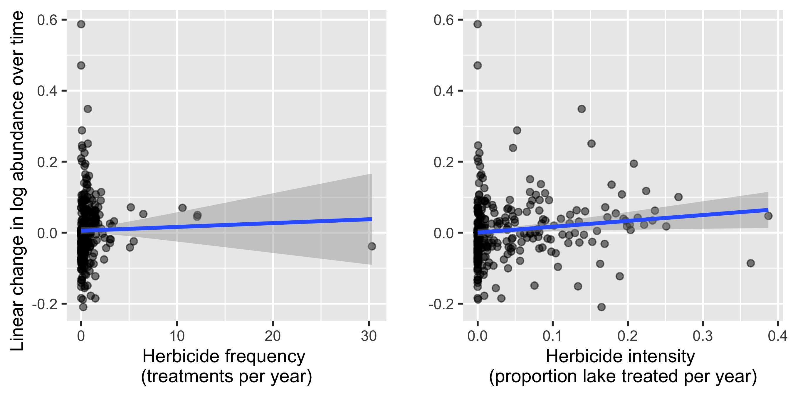
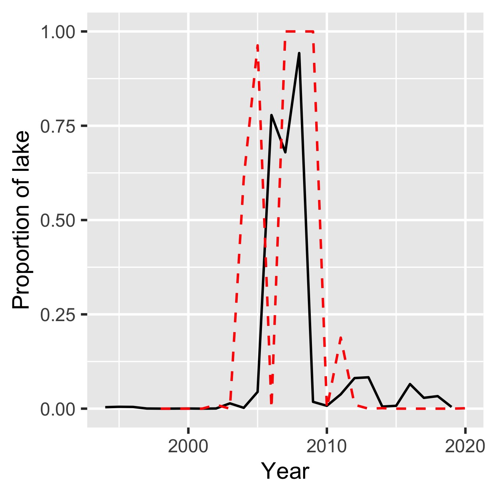

```{r setup, include=FALSE}
knitr::opts_chunk$set(echo = TRUE)

# clear environment
rm(list = ls())

# load packages
library(tidyverse)
```

## Overview

Research question: What are the direct and indirect effects of herbicide use on Florida lakes? We expect that herbicides directly reduce invasive plant abundances and indirectly increase native species richness through suppression of invasive plants. I am currently focusing on the direct effects.    

Florid Fish and Wildlife Commission (FWC) manages aquatic invasive plants by spraying lakes with herbicides. They have recorded the area sprayed, date of application, and other details from 2000 to the present. FWC has also performed annual surveys of plant communities in Florida lakes since 1983, which includes estimated abundances of invasive plants (area of lake covered). The strength of the plant survey dataset is in its temporal (37 years) and spatial (> 300 lakes) extent. Its accuracy, however, is questionable because FWC biologists use expert judgment and the speed of their boats for estimating area.   

Preliminary analyses suggest that the impact of herbicides is relatively quick and that comparing long-term trends of invasive plant abundance against long-term herbicide use yields misleading results:



For example, Maude lake has a relatively high treatment intensity (0.2, below: red dashed line is proportion of lake treated), but an overall increase in log-transformed abundance of the invasive plant hydrilla (below: black line is proportion of lake covered). Hydrilla was essentially absent pre-2004 and then suppressed to low (but not zero) levels after an outbreak. The high herbicide intensity from 2007-2009 likely suppressed this hydrilla population, but this is not captured with the above analysis. These types of dynamics (boom and bust, managing to low levels, but not eradication) are common.

<center>
{width=50%}  
<center>

The current approach is a state-space model, which tracks population change from one year to the next and can quantify the effects of herbicides on population transitions. It contains two components: a process model and an observation model. The process models describes the true population dynamics of a given invasive plant species, which can be affected by growth, herbicide use, and stochastic fluctuations. The observation model describes observed population dynamics, which are the true dynamics plus observation error. Because the model contains separate entries within matrices for each population (i.e., a lake), it is referred to as a "meta-population model" (i.e., a group of populations). The notation and format are adopted from [Holmes et al. 2021](https://nwfsc-timeseries.github.io/atsa-labs/).    

Because we have no dataset of herbicide application from 1983-1999, I plan to analyze the invasive plant abundance data from this time period separately (pre-herbicide model vs. herbicide model). The pre-herbicide model would provide growth rate estimates, which could be used as priors for the herbicide model. 

## Process model

The process model describes the true population dynamics of an invasive plant species: 

\begin{equation}
\begin{gathered}
\mathbf{x}_t = \mathbf{x}_{t-1}+\mathbf{u}+\mathbf{h}\mathbf{H}_t+\mathbf{w}_t \text{ where } \mathbf{w}_t \sim \,\text{N}(0,\mathbf{Q}) \\
\mathbf{x}_0 = \boldsymbol{\mu}
\end{gathered}   
\end{equation}

where $\mathbf{x}_t$ are the log-transformed population abundances for each lake at time $t$, $\mathbf{u}$ are the lake-specific growth rates, $\mathbf{h}$ is the effect of herbicides on abundance, $\mathbf{H}_t$ are the applications of herbicides, $\mathbf{w}_t$ represents lake-specific environmental and demographic stochasticity at time $t$, and $\mathbf{Q}$ is a matrix with a meta-population-level stochasticity term on the diagonal. 

Assuming we have four populations (i.e., lakes), the process model can be written:

\begin{equation}
\begin{gathered}
 \left[ \begin{array}{c}
    x_{1} \\
    x_{2} \\
    x_{3} \\
    x_{4}  \end{array} \right]_t = 
 \left[ \begin{array}{c}
    x_{1} \\
    x_{2} \\
    x_{3} \\
    x_{4}  \end{array} \right]_{t-1} +  
    \left[ \begin{array}{c}
    u_{1} \\
    u_{2} \\
    u_{3} \\
    u_{4}  \end{array} \right] + 
    \left[ \begin{array}{c}
    h \\
    h \\
    h \\
    h  \end{array} \right] +
    \left[ \begin{array}{c}
    H_{1} \\
    H_{2} \\
    H_{3} \\
    H_{4}  \end{array} \right]_t +
        \left[ \begin{array}{c}
    w_{1} \\
    w_{2} \\
    w_{3} \\
    w_{4}  \end{array} \right]_t
\\
\boldsymbol{\mu} = 
\left[ \begin{array}{c}
    \mu_{1} \\
    \mu_{2} \\
    \mu_{3} \\
    \mu_{4}  \end{array} \right]
\\
\mathbf{Q} = \begin{bmatrix}
    q & 0 & 0 & 0 \\
    0 & q & 0 & 0\\
    0 & 0 & q & 0 \\
    0 & 0 & 0 & q \end{bmatrix}
\end{gathered} 
\end{equation}
 
## Observation model

The observation model describes the data:

\begin{equation}
\mathbf{y}_t = \mathbf{x}_{t}+\mathbf{v}_t \text{ where } \mathbf{v}_t \sim \,\text{N}(0,\mathbf{R}) 
\end{equation}

where $\mathbf{y}_t$ are the observed log-transformed population abundances at time $t$, $\mathbf{v}_t$ are observation errors, and $\mathbf{R}$ is a matrix with lake-specific observation error terms on the diagonal. Each parameter is a matrix containing an entry for each population.

Assuming we have four populations, the observation model can be written:

\begin{equation}
\begin{gathered}
 \left[ \begin{array}{c}
    y_{1} \\
    y_{2} \\
    y_{3} \\
    y_{4}  \end{array} \right]_t = 
 \left[ \begin{array}{c}
    x_{1} \\
    x_{2} \\
    x_{3} \\
    x_{4}  \end{array} \right]_t +  
    \left[ \begin{array}{c}
    v_{1} \\
    v_{2} \\
    v_{3} \\
    v_{4}  \end{array} \right]_t
\\
\mathbf{R} = \begin{bmatrix}
    r_1 & 0 & 0 & 0 \\
    0 & r_2 & 0 & 0\\
    0 & 0 & r_3 & 0 \\
    0 & 0 & 0 & r4 \end{bmatrix}
\end{gathered} 
\end{equation}

## Implementation

### Stan

The template stan model is a multivariate autoregressive state-space model by Holmes et al. ([2021](https://nwfsc-timeseries.github.io/atsa-labs/sec-marss-fitting-with-stan.html)). It accounts for missing data by identifying the positions of positive y-values in the input data. Because the model uses the first-year abundance to estimate initial abundance (at $t = 0$), missing values in the first year were substituted with the first available abundances. The following sections describe the chunks within the stan code. This is the "pre-herbicide model" (no herbicide effects included yet).  

#### Data
The user provides the observations, after missing values have been removed, as a vector (y) and five attributes of the observations.  
1. the number of years: **TT**  
2. the number of groups (lakes): **N**  
3. the total number of non-NA observations (length of y): **n_pos**  
4. the column index (year) of the observation: **col_indx_position** (vector of length n_pos)  
5. the row index (lake) of the observation: **row_indx_position** (vector of length n_pos)  
The observations are fed to the model as a matrix with N rows and TT columns (each lake is a row).

#### Parameters
The parameters estimated by the model are:  
1. the initial states of each lake: **x0** (vector of length N)  
2. the population growth rates of each lake: **u** (vector of length N)  
3. the process error for each lake in each year: **pro_dev** (array of TT vectors with length N)  
4. the standard deviation of the overall process error: **sd_q** ($q$, real number)  
5. the observation error for each lake: **sd_r** ($r$, an array of N objects)  

#### Transformed parameters
The true population values (**x**) are calculated for each set of parameter estimates. **x** is an array of TT vectors with length N and the values are calculated following the process model equation. The model cycles through years within each lake.

#### Model
The likelihood for the observational model is:  
\begin{equation}
y_{t,l} \sim \,\text{N}(\mu = x_{t,l}, \sigma = r_{l})
\end{equation}
where $t$ indicates the year and $l$ indicates the lake. $x$ is a matrix with $t$ rows and $l$ columns. $x$ is therefore a transposed version of $y$ (columns become rows and rows become columns).  

The likelihood (?) for the process error is:
\begin{equation}
w_{t,l} \sim \,\text{N}(\mu = 0, \sigma = q)
\end{equation}
like $x$, $w$ is a matrix with $t$ rows and $l$ columns.  

The priors for the remaining parameters are:
\begin{equation}
\begin{gathered}
q \sim \,\text{student_t}(\nu = 3, \mu = 0, \sigma = 1)
\\
u \sim \,\text{N}(\mu = 0, \sigma = 2)
\\
x_{0,l} \sim \,\text{N}(\mu = y_{0,l}, \sigma = 10)
\\
r_{l} \sim \,\text{student_t}(\nu = 3, \mu = 0, \sigma = 1)
\end{gathered}
\end{equation}  

The code is in pre_herbicide_model_1.stan  

#### Testing

Using the code simulated_data.R, I simulated a dataset of 10 lakes with 18 years of data (simulated_data_pre_herbicide_model.csv). I fit the model with pre_herbicide_model_sim_dat.R and got a lot of errors (recorded in model_tuning.xlsx).  

I tried a non-centered parameterization (explained [here](https://mc-stan.org/users/documentation/case-studies/divergences_and_bias.html)), but that didn't help (pre_herbicide_model_2.stan, see model_tuning.xlsx).  

I have read the suggestion to simplify the model and build it back up, but I am unsure which parts make the most sense to simplify. I didn't write the original model code and I lack an understanding of how it is being solved.  
